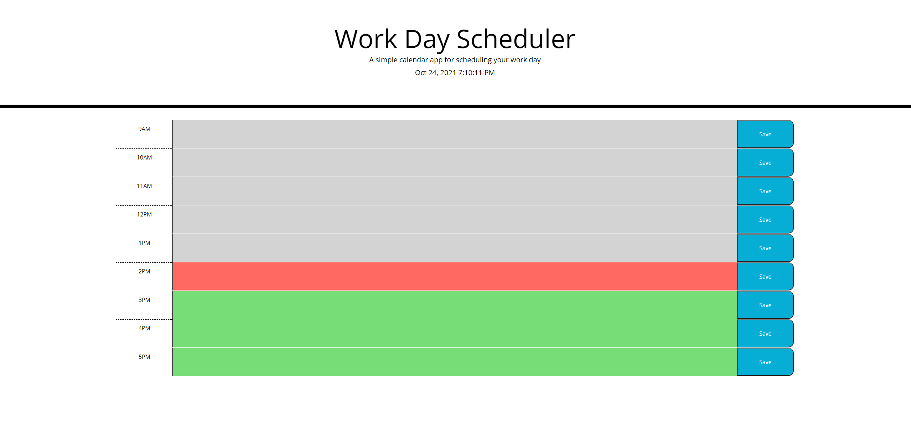

# <HW5-Day-Planner>

## Description
- Motivation for this project was a willingness to have a more organized day that included a structured time stamp to track and organize my days to be more organized.
- Why did you build this project? (Note: the answer is not "Because it was a homework assignment.") Build this project to deepen understanding of local storage concepts and how to set and get data. Also utilizing key value pairs to reference different data points for different usages. 
- What problem does it solve? This solved a huge problem in understanding coding good practices and efficiencies. Utilizing static HTML to create the same entities isn't a consist way of utilizing javascript or HTML.
- What did you learn? The biggest lesson besides the local storage and DOM traversal definitely comes with understanding how to create dynamic HTML elements and manipulating based on the desired outcome. 

## Table of Contents (Optional)
If your README is long, add a table of contents to make it easy for users to find what they need.
- [Installation](#installation)
- [Usage](#usage)
- [License](#license)
- [Features](#features)

## Installation
Create a new repository on your GitHub account and clone it to your computer.

When you're ready to deploy, use the git add, git commit, and git push commands to save and push your code to your GitHub repository.

Navigate to your GitHub repository in the browser and then select the Settings tab on the right side of the page.

## Usage
[Project.io](https://nodgyd.github.io/HW5-Day-Planner/)

## License
MIT License

Copyright (c) [2021] [nodgyd]

Permission is hereby granted, free of charge, to any person obtaining a copy
of this software and associated documentation files (the "Software"), to deal
in the Software without restriction, including without limitation the rights
to use, copy, modify, merge, publish, distribute, sublicense, and/or sell
copies of the Software, and to permit persons to whom the Software is
furnished to do so, subject to the following conditions:

The above copyright notice and this permission notice shall be included in all
copies or substantial portions of the Software.

THE SOFTWARE IS PROVIDED "AS IS", WITHOUT WARRANTY OF ANY KIND, EXPRESS OR
IMPLIED, INCLUDING BUT NOT LIMITED TO THE WARRANTIES OF MERCHANTABILITY,
FITNESS FOR A PARTICULAR PURPOSE AND NONINFRINGEMENT. IN NO EVENT SHALL THE
AUTHORS OR COPYRIGHT HOLDERS BE LIABLE FOR ANY CLAIM, DAMAGES OR OTHER
LIABILITY, WHETHER IN AN ACTION OF CONTRACT, TORT OR OTHERWISE, ARISING FROM,
OUT OF OR IN CONNECTION WITH THE SOFTWARE OR THE USE OR OTHER DEALINGS IN THE
SOFTWARE.
🏆 The previous sections are the bare minimum, and your project will ultimately determine the content of this document. You might also want to consider adding the following sections.

## Features
1. Allows user to input daily tasks within the input text window.
2. Then data is stored locally to be used at a later time.
3. Indicators to depict current time for day planner reference. 
4. Current date and time adjusting real time.
